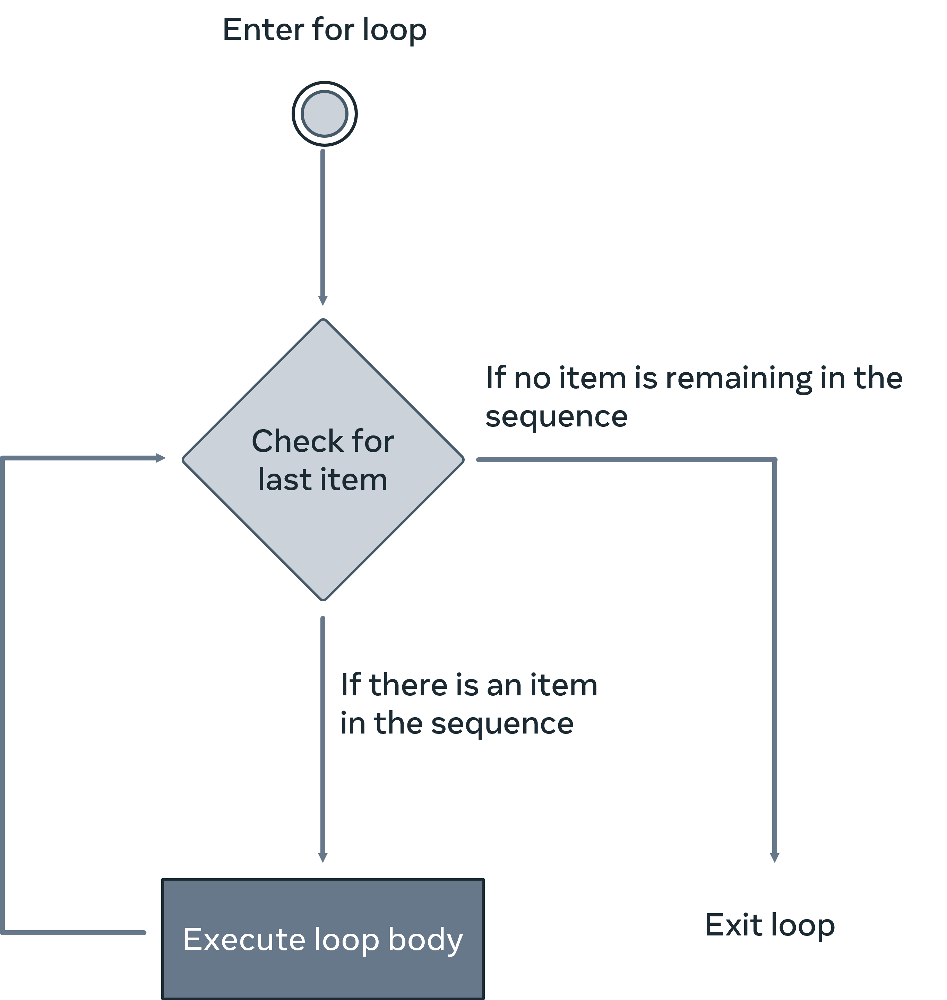
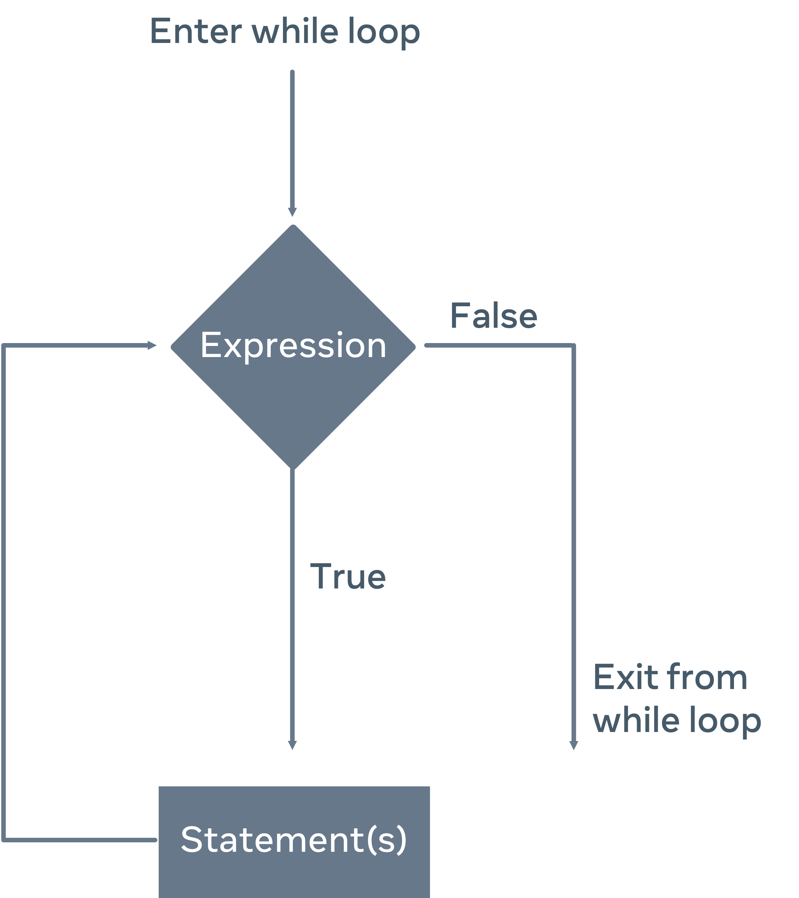

# Looping Constructs: Practical Examples

This reading introduces you to the different looping constructs in Python.

## For loop

Looping through data is a fairly common task in any programming language. The <b>for</b> loop makes it easy to work with any type of sequence in Python.  Let's run through some examples of <b>for</b> loops and the different ways you can use them.

```python
favorites = ['Creme Brulee', 'Apple Pie', 'Churros', 'Tiramisú', 'Chocolate Cake']

for dessert in favorites:
    print('One of my favorite desserts is', dessert)
```

In the code snippet above, the <b>for</b> loop iterates over the contents of the <b>favorites</b> list and prints out a sentence with the dessert name for each item in the list.

The <b>for</b> loop is based on the size or length of the elements to iterate over. 



## While loop

On the other hand, a <b>while</b> loop is based upon a condition being true. Once the condition is no longer true the loop stops. The amount of times the <b>while</b> loop is executed is not known ahead of time as it is with the <b>for</b> loop. 

If you take the above <b>for</b> loop example and convert that to the <b>while</b> loop alternative, you will end up with something like this:

```python
favorites = ['Creme Brulee', 'Apple Pie', 'Churros', 'Tiramisú', 'Chocolate Cake']

count = 0

while count < len(favorites):
    print('One of my favorite desserts is', favorites[count]);
    count += 1
```

Note that you needed to declare a <b>counter</b> variable. The <b>counter</b> variable is then compared to the length of the <b>favorites</b> list. As you loop through the data the <b>counter</b> is incremented. Once the condition <b>count < len(favorites)</b> is no longer true the loop will stop.

  