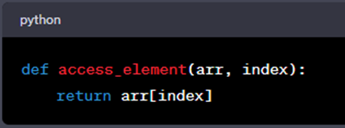
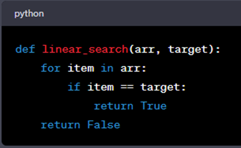
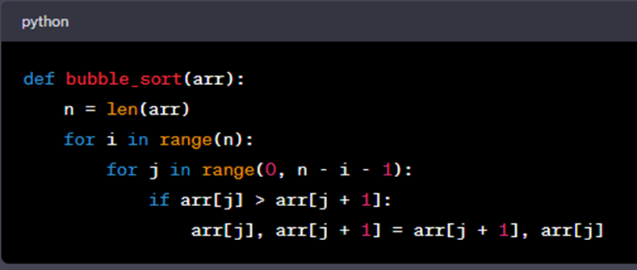
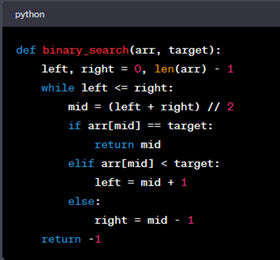

# Intro to Big-O notation

## Big-O

Big O notation is a fundamental concept in computer science and programming that helps you analyze and describe the efficiency of algorithms. It provides a standardized way of expressing how the runtime or resource usage of an algorithm grows as the size of the input data increases. This guide will explain Big O notation in simple terms with easy-to-understand Python examples.

## What is Big O Notation?

Imagine you are cooking pasta, and you want to determine how long it will take to boil a pot of water. You might consider factors like the size of the pot, the power of your stove, and the amount of water you need to heat. Similarly, in computer science, algorithms are analyzed based on their efficiency when dealing with different sizes of input data.

Big O notation is a mathematical notation that describes the upper bound or worst-case scenario for the time complexity of an algorithm. It helps us answer questions like:

* How does the runtime of an algorithm change as the input data gets larger?

* How does an algorithm scale with increased input size?

Big O notation is written as "O(f(n))," where "f(n)" is a function that represents the relationship between the input size (usually denoted as "n") and the algorithm's runtime or resource usage.

## Common Examples of Big O Notation

Let's explore some common examples of Big O notation using Python code:

### O(1) - Constant Time

In algorithms with constant time complexity, the runtime does not depend on the size of the input data. It remains constant, making it the most efficient scenario.

<b>Example:</b> Accessing an element in an array by its index.

No matter how large the array is, accessing an element by its index takes the same amount of time. The runtime is constant, and we denote it as O(1).

### O(n) - Linear Time

Algorithms with linear time complexity have a runtime that grows linearly with the size of the input data. This means that if the input data doubles in size, the runtime also doubles.

<b>Example:</b> Searching for a specific value in an unsorted list.

As the size of the list (<b>arr</b>) increases, the number of iterations the loop performs also increases linearly. Therefore, this algorithm has a time complexity of O(n).

### O(n^2) - Quadratic Time

Algorithms with quadratic time complexity have runtimes that grow with the square of the input size. As the input data size increases, the runtime increases quadratically.

<b>Example:</b> Bubble Sort, a simple sorting algorithm.

Bubble sort has a time complexity of O(n^2). As the size of the input list (<b>arr</b>) increases, the number of comparisons and swaps grows quadratically.

### O(log n) - Logarithmic Time

Algorithms with logarithmic time complexity have runtimes that grow logarithmically with the size of the input data. Logarithmic time complexity is considered very efficient.

<b>Example:</b> Binary search in a sorted list.

Binary search drastically reduces the search time as the size of the sorted list (<b>arr</b>) grows. It has a time complexity of O(log n).

### A Quick Breakdown

1. <b>Fastest:</b>

* <b>O(1) - Constant Time:</b> Lightning-fast! The algorithm's speed doesn't depend on how much data you have. It's like finding your favorite book on a perfectly organized bookshelf – it takes the same amount of time, whether you have 10 books or 1,000 books.

2. <b>Pretty Fast:</b>

* <b>O(log n) - Logarithmic Time:</b> Still quite speedy! It grows slowly as you add more data. Think of it as finding a name in a phone book by repeatedly splitting it in half – it gets faster even if the phone book gets bigger.

3. <b>Moderate:</b>

* <b>O(n) - Linear Time:</b> Respectable speed! If you have twice as much data, it takes about twice as long. It's like looking through a list of names one by one to find a match.

4. <b>Slower:</b>

* <b>O(n log n) - Linearithmic Time:</b> It's faster than quadratic but slower than linear. Comparable to sorting a deck of cards quickly using smart techniques.

5. <b>Slower Still:</b>

* <b>O(n^2) - Quadratic Time:</b> Getting slower as you add data. Like checking every combination of items on a list against each other – not great for large lists.

6. <b>Quite Slow:</b>

* <b>O(2^n) - Exponential Time:</b> Now we're talking about slow! It grows rapidly as you add data. Imagine a puzzle where you have to try every possible combination – it's really slow even for small puzzles.

7. <b>Incredibly Slow:</b>

* <b>O(n!) - Factorial Time:</b> The slowest of all! It's like solving a complex puzzle where the number of possible arrangements explodes as you add more pieces. Practically unusable for large problems.

## Why Big O Notation Matters

Big O notation is crucial for several reasons:

1. <b>Algorithm Comparison:</b> It allows us to objectively compare different algorithms and choose the most efficient one for a specific task.

2. <b>Performance Optimization:</b> Understanding Big O helps identify bottlenecks in code and optimize algorithms for better performance.

3. <b>Scalability:</b> Efficient algorithms are vital as applications and data sizes grow.

4. <b>Resource Management:</b> In resource-constrained environments, like embedded systems, choosing efficient algorithms is essential.

5. <b>Coding Interviews:</b> Big O notation is often tested in technical interviews and coding challenges, demonstrating your ability to analyze and optimize algorithms.

## Analyzing Code with Big O Notation

To analyze code using Big O notation, follow these steps:

1. <b>Identify the Input Size:</b> Determine what "n" represents in your code, often related to the size of the input data.

2. <b>Identify Loops and Iterations:</b> Look for loops in your code, as they often determine the primary factors affecting time complexity.

3. <b>Count Operations Inside Loops:</b> Count the number of operations inside each loop that depend on the input size "n."

4. <b>Combine Complexity:</b> If you have nested loops, multiply their complexities to determine the overall time complexity.

5. <b>Choose the Dominant Term:</b> In cases of combined complexity, focus on the term with the highest growth rate, as it will dominate the overall time complexity.

6. <b>Simplify:</b> Simplify the expression as much as possible by removing constant factors.

By following these steps, you can determine the time complexity of an algorithm and understand how it will perform as the input size increases.

In summary, Big O notation is a fundamental concept in computer science that helps us analyze and compare algorithms' efficiency. By understanding its basics and applying it to code, you can make informed decisions about algorithm selection and optimization, ensuring your programs run efficiently, even as data sizes grow.

